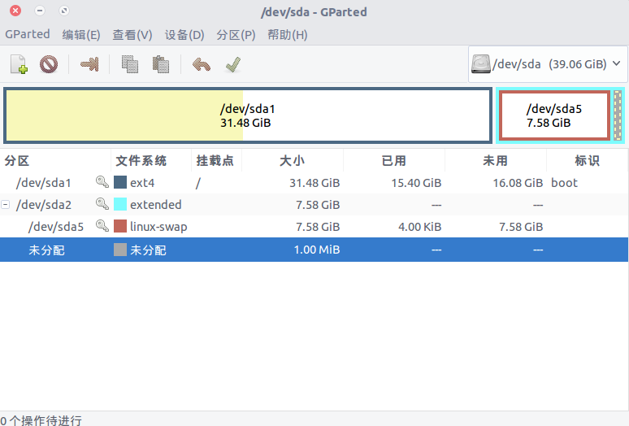

title: 给VirtualBox 4.0+的虚拟盘(VDI)文件扩容
description:
category: VirtualBox
tag: 虚拟机;扩容
-------------------------

## 给VirtualBox 4.0+的虚拟盘(VDI)文件扩容

VirtualBox 4.0 版增加了一个非常酷的新功能：您可以在几秒钟内完成对虚拟硬盘容量的修改。
而在此之前，您需要安装Gparted，并且操作也很繁琐。

在VirtualBox 4.0中修改虚拟盘镜像文件(.VDI)，首先找到您要修改的 .vdi 文件所在的文件夹。通常应该是

`~/.VirtualBox/HardDisks`

或者是

`~/VirtualBox VMs`

然后打开一个终端，把文件所在目录切换为当前目录

`~$ cd ~/.VirtualBox/HardDisks/`

并且运行下面这行命令：

`VBoxManage modifyhd YOUR_HARD_DISK.vdi --resize SIZE_IN_MB`

其中参数 YOUR_HARD_DISK.vdi 是您要修改的 VirtualBox 虚拟硬盘镜像文件。而参数 SIZE_IN_MB 是指修改后的硬盘容量，单位是兆字节。
比如下面这行命令将会把名为"ubuntu.vdi"的 VirtualBox 硬盘容量修改为40000兆。

`VBoxManage modifyhd ubuntu.vdi --resize 40000`

几秒后VirtualBox硬盘的容量修改完毕

## 扩展分区

启动虚拟机，通过df -h查看发现，根目录大小还是原样，下面我们通过gparted来扩展分区

查看当前系统分区情况

`sudo fdisk -l `

首先创建新的分区:

`sudo fdisk /dev/sda`

然后n, p, ...等各种回车后创建了分区4

将分区格式化为ext4格式:

`sudo mkfs.ext4 /dev/sda4`

现在准备工作完成, 目前虚拟机的空间分布为:

***	| [ / ]	16G | [ SWAP ] 2G	|	[ FREE ]	22G|	***

因为只是用的根分区的简单分区方式, 所以下面直接使用gparted重新调整一下大小:

>禁用[SWAP], 删除, 此时后面会合并为[FREE]24G

>调整[/]大小为32G, 然后创建[SWAP]为8G

调整后空间分布如下:

***	| [ / ]	32G | [ SWAP ] 8G	|***

## 遗留问题

使用gparted调整后,系统启动明显变慢,发现是新的交换区没有起作用导致,打开/etc/fstab:

```
bb@bb-ubuntu:~$ sudo gedit /etc/fstab

# /etc/fstab: static file system information.
#
# Use 'blkid' to print the universally unique identifier for a
# device; this may be used with UUID= as a more robust way to name devices
# that works even if disks are added and removed. See fstab(5).
#
# <file system> <mount point>   <type>  <options>       <dump>  <pass>
# / was on /dev/sda1 during installation
UUID=d578e361-4466-4cb9-b3e2-cdf61b2db054 /               ext4    errors=remount-ro 0       1
# swap was on /dev/sda5 during installation
UUID=35497348-620e-49a5-be92-4ab9201bb3e5 none            swap    sw              0       0

```

查询分区UUID, 使用上面提示的'blkid':

`sudo blkid'

```
bb@bb-ubuntu:~$ sudo blkid

/dev/sda1: UUID="d578e361-4466-4cb9-b3e2-cdf61b2db054" TYPE="ext4" PARTUUID="e9001d6c-01"
/dev/sda5: UUID="8d5f0639-b427-4cb1-b360-cdabaff459b2" TYPE="swap" PARTUUID="e9001d6c-05"

```

确认分区挂载关系:

```
bb@bb-ubuntu:~$ sudo fdisk -l

Disk /dev/sda: 39.1 GiB, 41943040000 bytes, 81920000 sectors
Units: sectors of 1 * 512 = 512 bytes
Sector size (logical/physical): 512 bytes / 512 bytes
I/O size (minimum/optimal): 512 bytes / 512 bytes
Disklabel type: dos
Disk identifier: 0xe9001d6c

Device     Boot    Start      End  Sectors  Size Id Type
/dev/sda1  *        2048 66021375 66019328 31.5G 83 Linux
/dev/sda2       66021376 81919999 15898624  7.6G  5 Extended
/dev/sda5       66023424 81917951 15894528  7.6G 82 Linux swap / Solaris

```

由以上三组配置可以看到, fstab中的swap交换分区挂载的UUID应该更新为/dev/sda5:
`8d5f0639-b427-4cb1-b360-cdabaff459b2`

修改后的/etc/fstab:

```
# /etc/fstab: static file system information.
#
# Use 'blkid' to print the universally unique identifier for a
# device; this may be used with UUID= as a more robust way to name devices
# that works even if disks are added and removed. See fstab(5).
#
# <file system> <mount point>   <type>  <options>       <dump>  <pass>
# / was on /dev/sda1 during installation
UUID=d578e361-4466-4cb9-b3e2-cdf61b2db054 /               ext4    errors=remount-ro 0       1
# swap was on /dev/sda5 during installation
UUID=8d5f0639-b427-4cb1-b360-cdabaff459b2 none            swap    sw              0       0
```

然后重启, 就能感受到系统启动加速了很多, 上个系统分区图:



## 扩展

公司电脑使用的是Win7+VirtualBox(Ubuntu)方式, 家中电脑安装的为Win7+Debian双系统方式, 因分区方式没注意, 近期根空间即将变慢
所以又重新折腾了一次

主要是修改/etc/fstab, 使用gparted调整和移动分区, 修改fstab一定要备份!!
